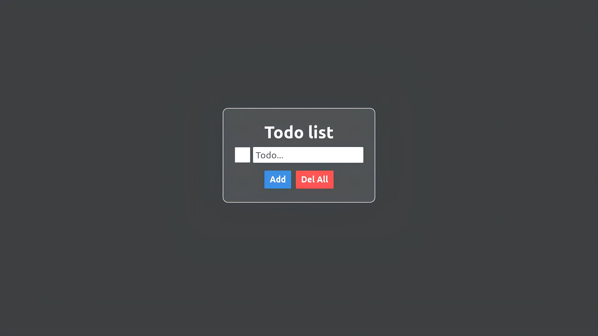

# 📝 To-Do List App (with Local Storage)

A simple and responsive to-do list app built using HTML, CSS, and vanilla JavaScript. Tasks persist using the browser's localStorage.

Preview

🚀 Features

- Add new tasks
- Delete individual task
- Save tasks to localStorage (auto-persistent)
- Clear all tasks
- Clean and minimal UI
